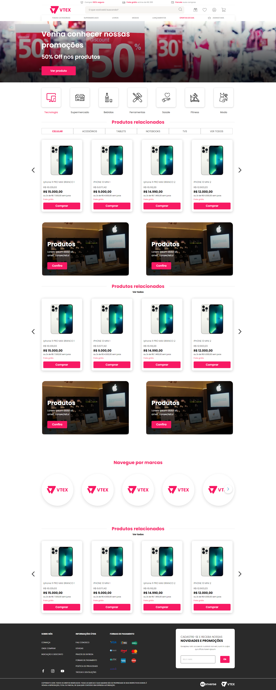

# Projeto Teste Econverse

## 📖 Descrição

Essa é uma página inicial de um E-commerce desenvolvida em React. Na vitrine, quando clicado em 'Comprar', aparece um modal com mais detalhes sobre o produto.

## 🔎 Como usar

### Clone esse repositório

```bash
$ git clone https://github.com/anderson-rodriguesdev/teste-front-end-jr.git
```

### Navegue para a pasta raiz

```bash
$ cd teste-front-end-jr
```

### Instale as dependências

```bash
$ npm install
```

### Inicie o projeto com o comando:

```bash
$ npm run dev
```

# 💻 Layout


